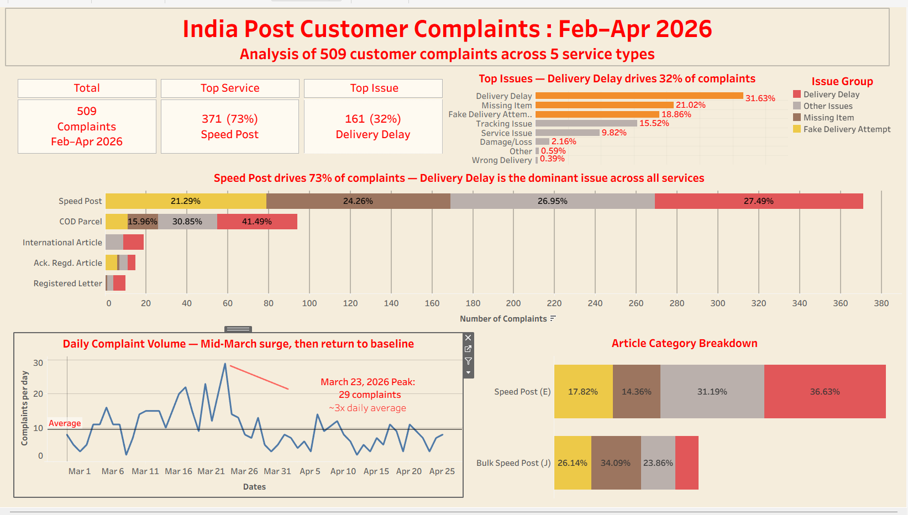

# India Post Customer Complaint Analysis (Feb–Apr 2026)

> Analyzing 509 customer complaints from public Twitter data to identify systemic service quality issues at India Post — the world's largest postal network.

## 📊 Live Dashboard
[View interactive Tableau dashboard →](https://public.tableau.com/app/profile/sangeeta.mishra/viz/IndiaPostComplaintsanalysis/Dashboard1?publish=yes&showOnboarding=true)



---
## Key Findings

- Speed Post accounts for 73% of complaints (371 of 509)
- Top 3 issues = 72% of all complaints: Delivery Delay (32%), Missing Item (21%), Fake Delivery Attempt (19%)
- Mid-March surge (Mar 16–23) produced ~30% of complaints, peaking at 29 on Mar 23 — likely tied to India's financial year-end pressure on post office operations
- Tracking issues at 16% suggest a separate digital/portal weakness, distinct from physical delivery problems
- E-prefix and J-prefix Speed Post show different dominant failure modes (delays vs. missing items)

---

## About the Project 
For over a decade, I worked inside India Post, first as a Postal Assistant, then as an Executive Assistant to a Divisional Manager, and finally as Head of Postal Saving Bank in Sambalpur. I saw complaints come in every day. I knew which days were busy, which articles tended to get stuck, and the difference between a delay caused by transit and a delay logged as a "fake delivery attempt" which means a postman marks an address as visited without actually showing up.

When I moved to the United States in 2023 to pursue an MBA in Business Analytics, I started learning Tableau, and I wanted a portfolio project I cared about. So I picked the topic I knew best — but this time I would look at it through data instead of from behind a counter.

---
### The Question
As I have learned, India Post handles over 1.5 billion mail items each year across 156,000+ post offices. Despite this scale, customer complaints on Twitter to ongoing service problem. Through this project I have analyzed 509 publicly posted complaints from Twitter (Feb 27 – Apr 25, 2026) to answer:

1. **Speed Post would dominate.** It always did inside our division, simply because of volume.
2. **Delivery Delay would be the #1 issue.** Every regional manager I worked under knew this.
3. **Bulk Speed Post (J-prefix) would behave differently from regular Speed Post (E-prefix).** I wasn't sure exactly how, but I suspected handling at sorting hubs was different for bulk shipments.

---

### What I Found

The first two guesses were confirmed. **Speed Post drives 73% of all complaints.** **Delivery Delay is the #1 issue at 32%.** A decade of operational gut feeling held up against the data.

**Tracking issues at 16%** suggest the digital portal and tracking systems are a separate pain point from physical delivery execution. Part of the cause is structural: India Post serves some of the country's most remote regions, including small villages where reliable electricity and network connectivity are not consistently available. Without network access at handover points, barcode scans cannot update the tracking system in real time — so even when an article is moving correctly, the customer-facing tracking status can appear stuck or delayed.

**"Fake Delivery Attempt" at 19%** (delivery marked complete without an actual attempt) points to a material customer-trust concern. Each repeated occurrence erodes confidence in both the tracking system and the delivery process over time.

The third question is where the project got more interesting.

When I split Speed Post by article prefix — regular Speed Post (E-prefix) versus bulk Speed Post (J-prefix) — the failure patterns were noticeably different:

- **Regular Speed Post (E-prefix):** 37% of complaints were Delivery Delays.
- **Bulk Speed Post (J-prefix):** Only 16% Delivery Delays — but **34% Missing Items**, more than double the rate of regular shipments.

Regular shipments mostly arrive late. Bulk shipments are more often reported as missing. The data doesn't tell me why, but the pattern is consistent enough to suggest these are worth examining as two distinct issues rather than one.

I also noticed a sharp surge in mid-March (Mar 16–23) that produced about 30% of all complaints in the dataset, peaking at 29 complaints on March 23 which is roughly three times the daily average. 

The timing aligns with the end of India's financial year (March 31). From my years inside a postal division, I know this is one of the most operationally stressful periods of the year — post offices handle a surge in PLI/RPLI insurance premium payments, postal savings transactions, government and tax-related correspondence, and bulk mail volume, all while staff are pushed to meet year-end performance targets. This is a plausible hypothesis for the spike, but it would need historical year-on-year complaint data to confirm whether the mid-March pattern repeats annually or was specific to 2026.

---
## 🛠️ Tools & Skills Demonstrated

- **Tableau Public** — dashboard design, calculated fields, table calculations, color theory, storytelling
- **Python** (pandas, openpyxl) — data cleaning and consolidation
- **Excel** — initial data structuring and validation
- **Data analysis** — categorical analysis, segmentation, trend analysis

---

## 📁 Data Source & Limitations

**Source:** 509 customer complaints manually collected from public Twitter posts mentioning India Post during Feb 27 – Apr 25, 2026.

**Limitations I want to be transparent about:**
- **Selection bias** — only customers who complain on Twitter are represented. The "silent majority" who never post is missing.
- **No volume context** — without total India Post shipment volume by service, complaint counts can't be converted to "complaints per 1,000 shipments." A direction for future work.
- **No booking date** — without booking dates, I can't compute time-to-complaint or SLA breach analysis. This is the next planned enhancement.
- **2-month window** — captures a snapshot, not seasonal patterns.

These caveats matter — but the dataset is large enough (~509 rows) and clean enough to surface meaningful patterns.

---

## 🔧 Methodology

1. **Data collection** — manually compiled 511 raw rows from public Twitter complaint posts
2. **Data cleaning** (Python/pandas):
   - Consolidated 3 spelling variants of "Speed Post" into one category
   - Merged 13 issue categories into 8 by combining tiny categories (Wrong Delivery merged into Address Issue, etc.)
   - Removed 1 leaked header row
   - Added derived columns: article_prefix, article_category (categorizing by tracking number prefix per UPU S10 standard)
3. **Analysis in Tableau**:
   - 5 worksheets covering KPIs, issue distribution, service breakdown, daily trend, and Speed Post deep-dive
   - Calculated fields for issue grouping and category cleanup
   - Table calculations for percentage-within-bar metrics
4. **Visualization** — single-page Tableau dashboard with India Post brand-themed color palette (red and yellow)

---

## 📂 Repository Structure

```
india-post-complaint-analysis/
│
├── README.md                                  # You are here
│
├── data/
│   ├── raw data.xlsx                          # Original Twitter-scraped data
│   ├── india_post_complaints_clean.csv        # Cleaned analysis-ready dataset
│   └── india_post_data_cleaning.py            # Python cleanup script
│
├── analysis/
│   └── india_post_complaints_analysis.xlsx    # Excel summary with pivots
│
├── tableau/
│   └── India_Post_Complaints.twbx              # Tableau packaged workbook
│
└── images/
    ├── Dashboard.png                          # Full dashboard screenshot
                     
```

## 🎓 What I Learned

- **Real-world data is messy** — even my "clean" dataset had spelling variants, leaked headers, and inconsistent categorization that needed reconciling before analysis.
- **Categorization choices change the story** — merging 13 issue types into 4 groups made the dashboard cleaner but required tradeoff thinking about which detail to preserve.
- **Article-prefix segmentation revealed insight I wouldn't have seen otherwise** — without breaking out E vs J prefixes, I would have missed the bulk-vs-individual shipment behavioral difference.
- **Color choice matters** — using India Post's brand palette (red/yellow) made the dashboard feel intentional rather than generic.
- **Tableau's table calculations require careful "Compute Using" settings** — defaults often give wrong percentages without you realizing.

---

## 🚀 Next Steps

If/when I obtain booking dates for these complaints, the next analysis will include:
- `days_to_complaint` derived metric
- SLA breach analysis (Speed Post promises 1–4 day delivery)
- Time-to-failure curves
- Seasonality patterns
- Domestic vs international complaint origin (via UPU S10 prefix)

---

## 📫 Contact

**Sangeeta Mishra**  
Data Analyst | MBA in Business Analytics  
[LinkedIn](https://www.linkedin.com/in/sangeeta-mishra-874b3228) | 123.sangeeta@gmail.com
